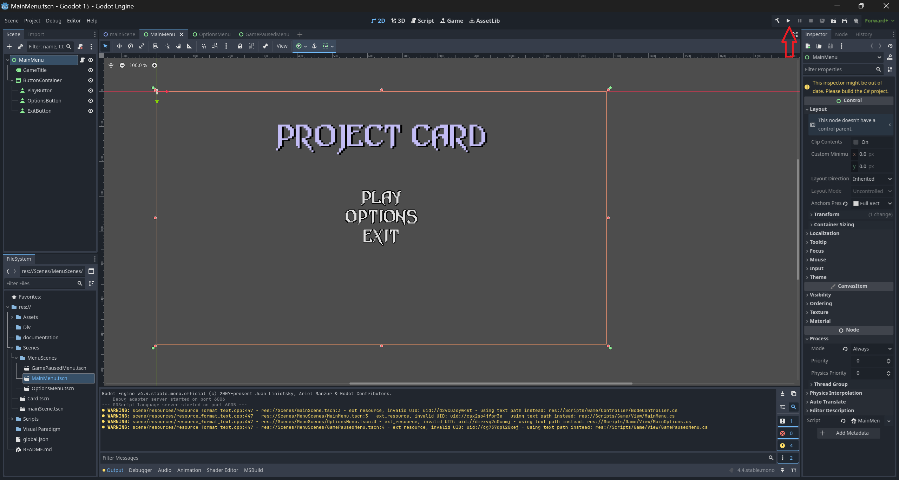

# Project Card - Group 15

Project Card is a game project built with the game engine `Godot`.

# Installation & Development environment
To set up a development environment for this project; A few tools and Software Development Kits are necessary

 - [Godot 4.4, Mono Edition (Windows)](https://github.com/godotengine/godot-builds/releases/download/4.4-stable/Godot_v4.4-stable_mono_win64.zip) | [Godot 4.4, Mono Edition (Mac)](https://github.com/godotengine/godot-builds/releases/download/4.4-stable/Godot_v4.4-stable_mono_macos.universal.zip)
 - [.NET SDK 8.0 (Windows)](https://dotnet.microsoft.com/en-us/download/dotnet/thank-you/sdk-8.0.407-windows-x64-installer) | [.NET SDK 8.0 (Mac)](https://dotnet.microsoft.com/en-us/download/dotnet/thank-you/sdk-8.0.407-macos-arm64-installer)
 - (Any) of the optional IDE with support for `C#`
    - [Visual Studio Code](https://code.visualstudio.com/)
    - [Rider](https://www.jetbrains.com/rider/)
    - [Visual Studio](https://visualstudio.microsoft.com/vs/community/)

# Opening the project
To open the project, use the Godot executable and open the `project.godot` file using the `Godot` executable.

To open the source code for the project, use any of the Integrated Development Environments and open the `Goodot 15.sln` solution file.
 - Visual Studio Code may require extensions for `C#` syntax highlighting.  

# Building & Running the project
Building the project requires `.NET 8.0`. To build the project through Godot. Simply run the Build and run the project in the Godot editor.

This is also possible to do through your IDE of your choice.